### These procedure steps will be followed on the simulator

1. When you click on Identification and study on Physical Properties of Rock, a new window will open, Click Next to proceed. 
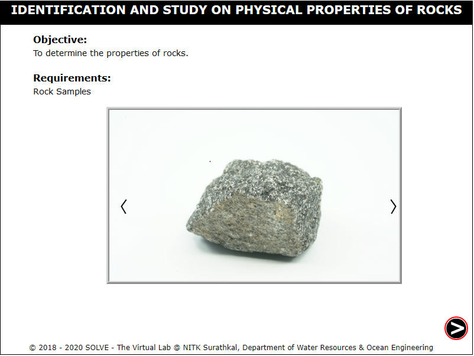 

2. Click on the Next button on the slide show of the rocks to select the rock for identification, click OK, Click Next. 
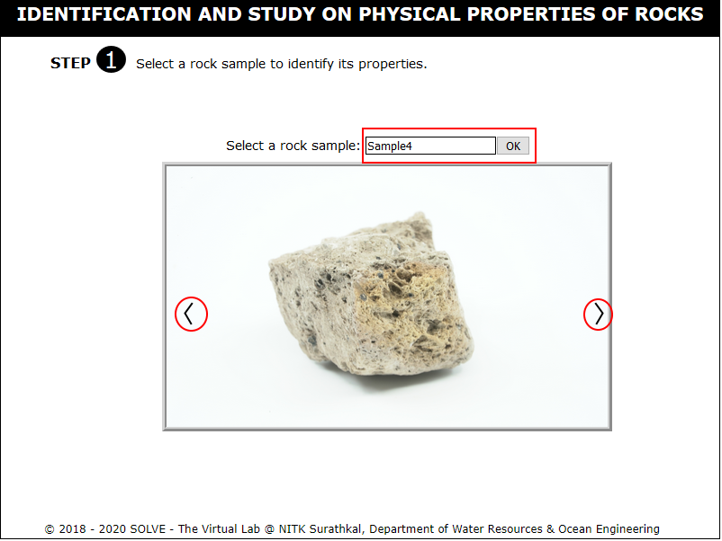 

3. Click on Rock in the menu to view the selected rock in multiple views and to get a zoomed view. 
 

4. Click on Group in the menu and select the group to which the rock belongs by clicking on the radio button. Click on Check Answer, Reset Answer or Get Correct Answer buttons available. 
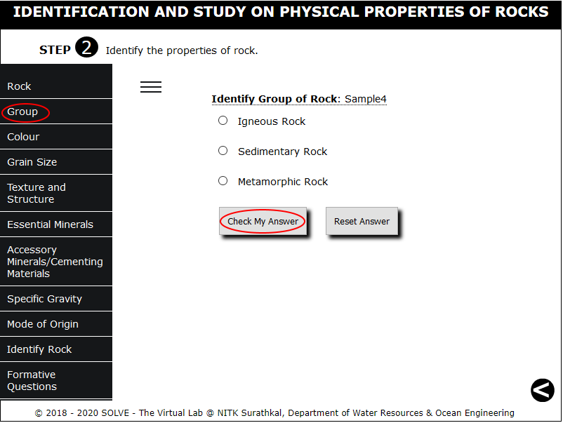 

5. Click on Colour in the menu and select the possible colours of the selected rock by checking on the checkbox. Click on Check Answer, Reset Answer or Get Correct Answer buttons available. 
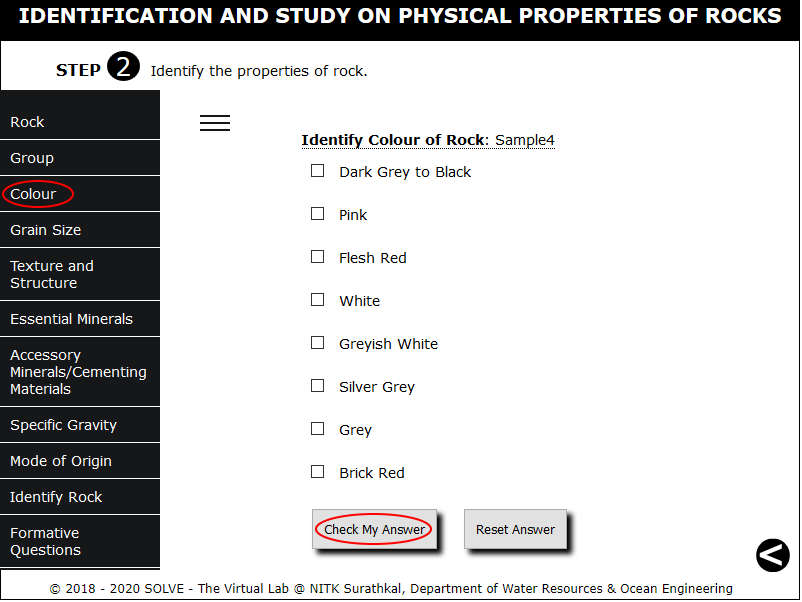 

6. Click on Grain Size in the menu and select the size group of the rock by clicking on the radio button. Click on Check Answer, Reset Answer or Get Correct Answer buttons available. 
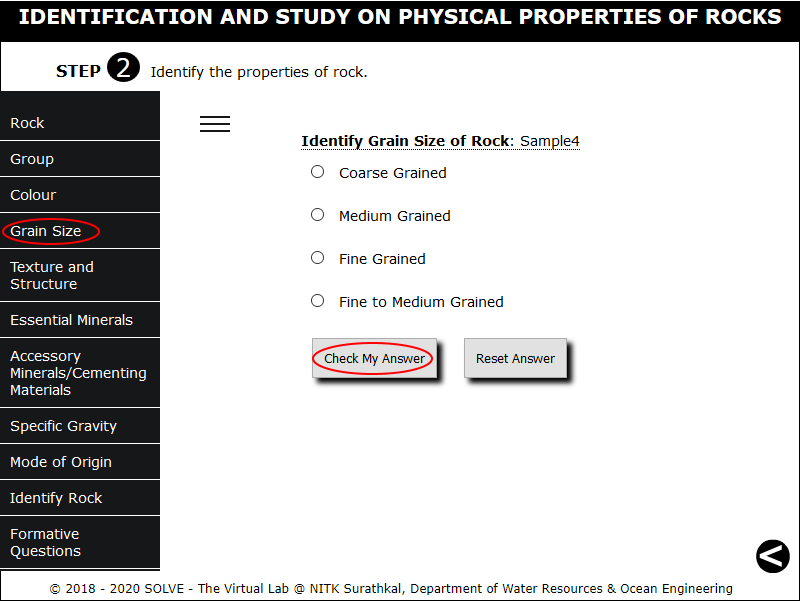 

7. Click on Texture and Structure in the menu and select the rock property by clicking on the radio button. Click on Check Answer, Reset Answer or Get Correct Answer buttons available. 
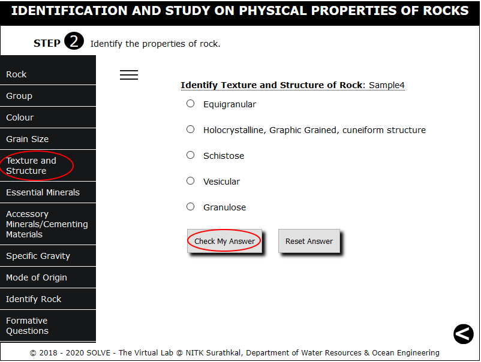 

8. Click on Essential Minerals in the menu and select the possible minerals of the selected rock by checking on the checkbox. Click on Check Answer, Reset Answer or Get Correct Answer buttons available. 
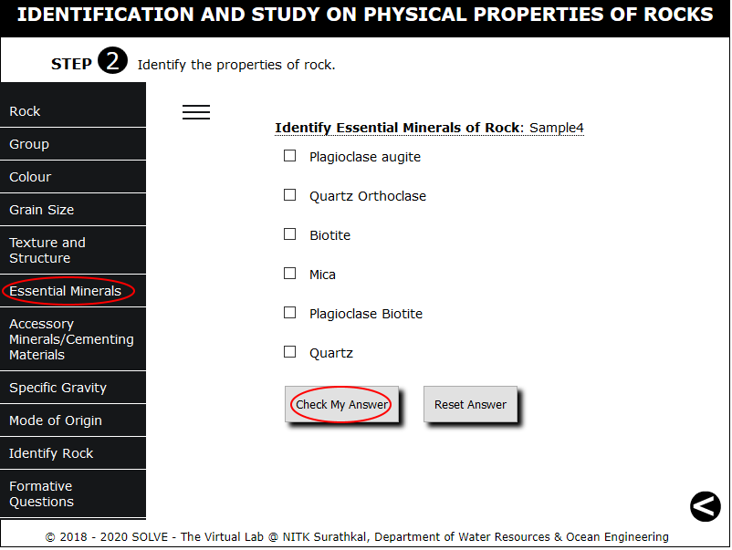 

9. Click on Accessory Minerals/ Cementing Materials in the menu and select the property of the selected rock by checking on the checkbox. Click on Check Answer, Reset Answer or Get Correct Answer buttons available. 
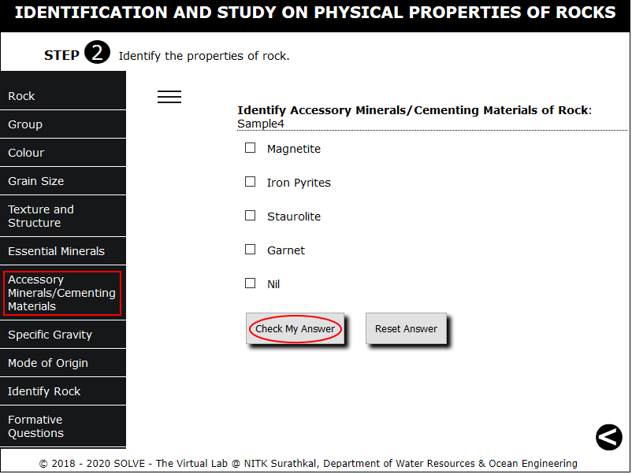 

10. Click on Specific Gravity in the menu and select the appropriate value of the selected rock by clicking on the radio button. Click on Check Answer, Reset Answer or Get Correct Answer buttons available. 
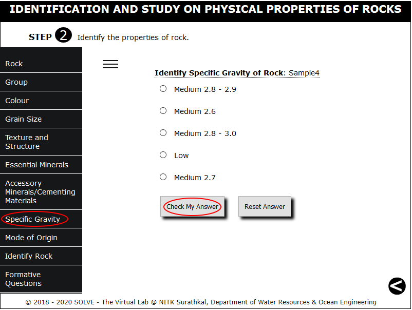 

11. Click on Mode of Origin in the menu and select the parent rock of the selected rock by clicking on the radio button. Click on Check Answer, Reset Answer or Get Correct Answer buttons available. 
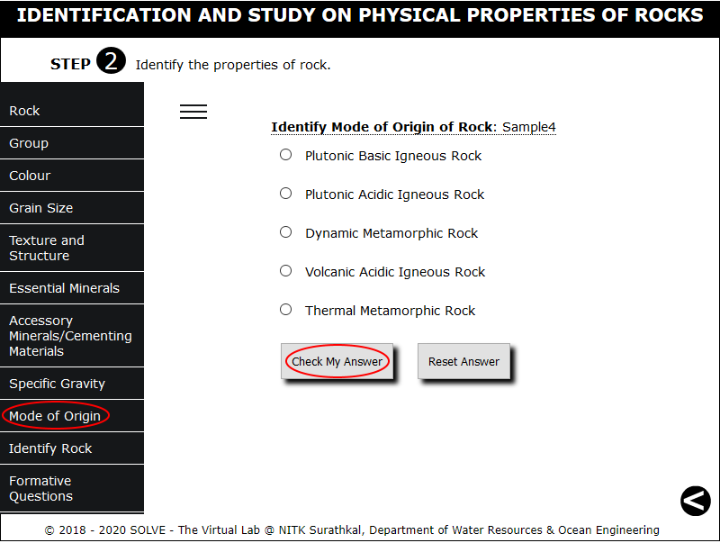 

12. Click on Identify Rock in the menu to view the properties that got skipped during the process and finally identify the rock based on the property. 
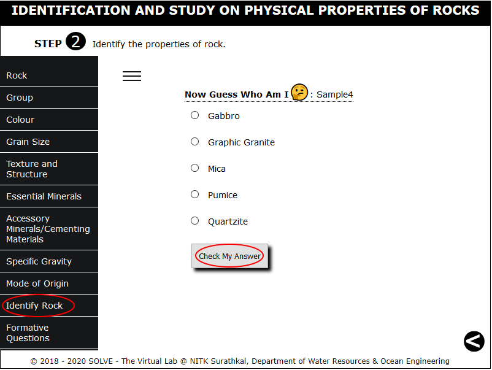 

13. Click on Formative Questions to answer the questions dispalyed and click on the previous button displayed in the bottom right corner to select other sample. 
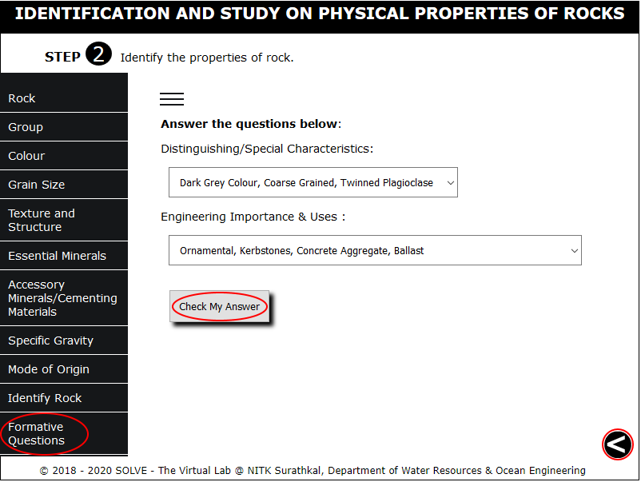 
